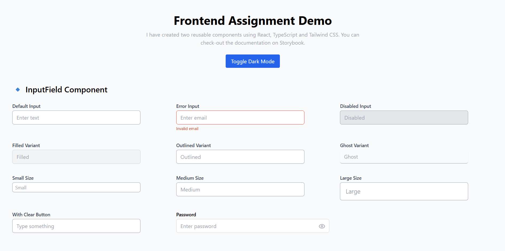
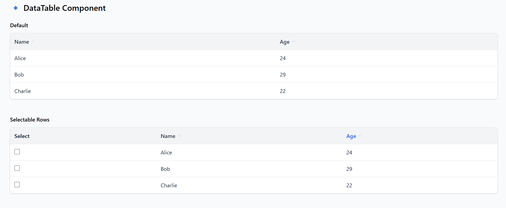

# Frontend Assignment 🚀

This project contains two reusable, production-ready components built with **React**, **TypeScript**, **TailwindCSS**, and **Storybook**.  
It demonstrates component reusability, responsive design, accessibility, and clean styling for a frontend assignment.

---

## 📌 Components

### 🔹 InputField
A flexible input component supporting:
- ✅ Label, placeholder, helper text, and error message
- ✅ States: default, disabled, invalid
- ✅ Variants: filled, outlined, ghost
- ✅ Sizes: small, medium, large
- ✅ Clear button functionality
- ✅ Password toggle with eye icon
- ✅ Accessible with `aria-*` attributes
- ✅ Light & dark theme support

### 🔹 DataTable
A reusable data table with:
- ✅ Display of tabular data
- ✅ Column sorting
- ✅ Row selection (single & multiple)
- ✅ Loading state
- ✅ Empty state
- ✅ Accessible with ARIA roles (`row`, `columnheader`, `aria-sort`)

---

## 🛠️ Tech Stack

- **React 18 + TypeScript**
- **TailwindCSS v3**
- **Storybook (with React-Vite)**
- **Heroicons (for password toggle)**
- GitHub for version control & deployment-ready

---

## 📂 Project Structure

```plaintext
📂 frontend-assignment
├── 📂 src
│   ├── 📂 components
│   │   ├── 📂 DataTable
│   │   │   ├── DataTable.tsx
│   │   │   └── DataTable.stories.tsx
│   │   ├── 📂 InputField
│   │   │   ├── InputField.tsx
│   │   │   └── InputField.stories.tsx
│   ├── App.tsx
│   ├── index.css
│   └── main.tsx
│
├── 📂 public
│   ├── 📂 Screenshots-and-GIFs
│   │   ├── 📂 GIFs
│   │   │   ├── clear button.gif
│   │   │   ├── diabled input.gif
│   │   │   ├── password toggle.gif
│   │   │   ├── selectable data table.gif
│   │   │   ├── sorting by name and age.gif
│   │   │   └── ToggleDarkMode.gif
│   │   └── 📂 Screenshots
│   │       ├── DataTable.png
│   │       ├── Input Field.png
│   │       └── loading and no data fields.png
├── 📂 .storybook
├── 📂 node_modules
├── package.json
└── README.md
```
---
## 📸 Screenshots & GIFs

### GIFs

- **Clear Button:**  
  

- **Disabled Input:**  
  

- **Password Toggle:**  
  

- **Selectable Data Table:**  
  

- **Sorting by Name and Age:**  
  

- **Toggle Dark Mode:**  
  

### Screenshots

- **Data Table:**  
  

- **Input Field:**  
  

- **Loading and No Data Fields:**  
  
---
## ⚡ Setup Instructions

### Clone the repository

```bash
git clone https://github.com/UtsavShekhar99/frontend-assignment.git
```

### Install dependencies

```bash
npm install
```

### Run the frontend app

```bash
npm run dev
```

Open [http://localhost:5173](http://localhost:5173) in your browser.

### Run Storybook locally

```bash
npm run storybook
```

Open [http://localhost:6006](http://localhost:6006) to preview the components.

### Build Storybook for production

```bash
npm run build-storybook
```

This generates a static Storybook in the `storybook-static` folder, ready for deployment.

---

## 🔹 Storybook Preview  

[**View Storybook**](https://68a590482b617b1d3d3b688c-cytwgwqbya.chromatic.com/?path=/story/components-datatable--default)
The components are also deployed online via Chromatic:  
---

## 📝 Description of My Approach

For this assignment, I focused on building reusable, modular components with TypeScript for type safety and TailwindCSS for consistent styling.

- **InputField:**  
  Implemented multiple states, sizes, and variants, added optional clear and password toggle features, and ensured accessibility with `aria-*` attributes.

- **DataTable:**  
  Created a table component that supports sorting, single and multiple row selection, loading, and empty states. It is responsive and accessible with proper ARIA roles.

The project structure is designed for scalability, making it easy to add more components in the future. I used Storybook to document and visually test all components, and deployed it via Chromatic for a live preview.
